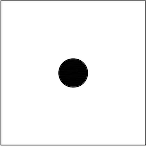
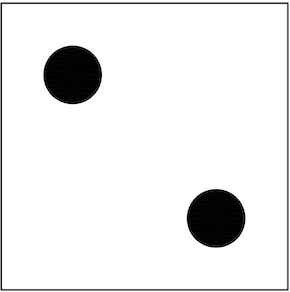
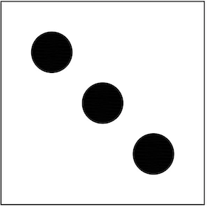
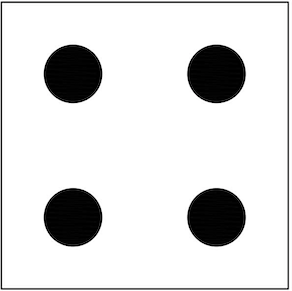
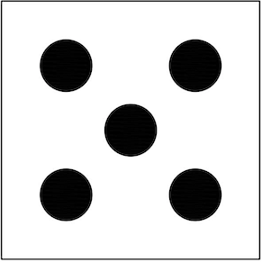
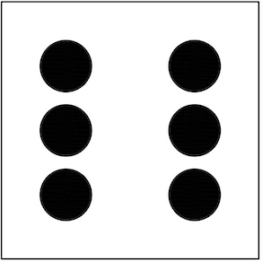

# jQueryDiceGame
Dice game using jQuery
<!DOCTYPE html>
<html>
  <head>
    <title>jQuery Dice Game</title>
    
    
    
  </head>

  <body>
    <form name="form1">
      
jQuery Dice Game

      

        

          
          
          
        

        

          
          
          
        

        

          <input type="button" value="Redo" id="bt1" />
        

      

      

        
        
        
      

      

    </form>
  </body>
</html>
